# FinVault — Full-Stack Engineering Roadmap
### From Foundations to Production-Grade Multi-Agent AI

> **How to read this document**: Each of the 9 layers maps theory from the roadmap to actual, working code in this repository. Where FinVault already implements something, the relevant file is cited. Where a gap exists, actionable next steps are given. Every flow diagram shows real data movement through real code.

---

## Master Flow: How All 9 Layers Compose Together

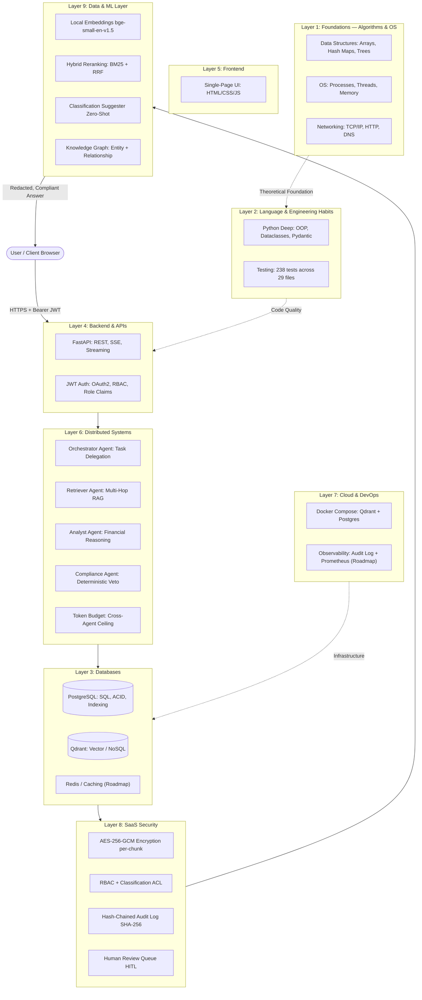

---

## Layer 1 — Foundations: Algorithms, OS, Networking

> *MIT 6.006 (Algorithms), MIT 6.033 (OS), Stanford CS144 (Networking)*

**Data Structures in FinVault:**
- **Hash Maps (`dict`)**: O(1) lookups for `ROLE_RANK`, `CLASSIFICATION_RANK`, `_PII_PATTERNS`, `_INJECTION_PATTERNS`, tool registry in `agents/base.py`.
- **Sorted Lists**: `sorted()` in `retriever.py` for chunk reordering by `chunk_index` and RRF scores.
- **Graphs**: `graph_nodes_table` + `graph_edges_table` in `db.py` model a real entity-relationship graph.
- **Arrays + BM25 Matrix**: `rank_bm25.BM25Okapi` uses an inverted index term-document matrix internally.

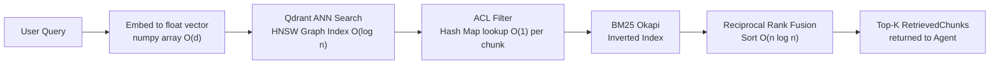

**OS Concepts:**
- `uvicorn` runs FastAPI in an **async I/O event loop** (single process, multiple coroutines).
- `/query/stream` route uses a **background thread** + `queue.Queue` to bridge sync SQLAlchemy with async SSE.

**Networking:**
- FastAPI exposes **HTTP/1.1 REST** endpoints.
- `/query/stream` uses **Server-Sent Events (SSE)** — streaming chunks as `event:` / `data:` frames.

---

## Layer 2 — One Language Deep + Engineering Habits

> *Python (deep), git properly, testing (unit + integration)*

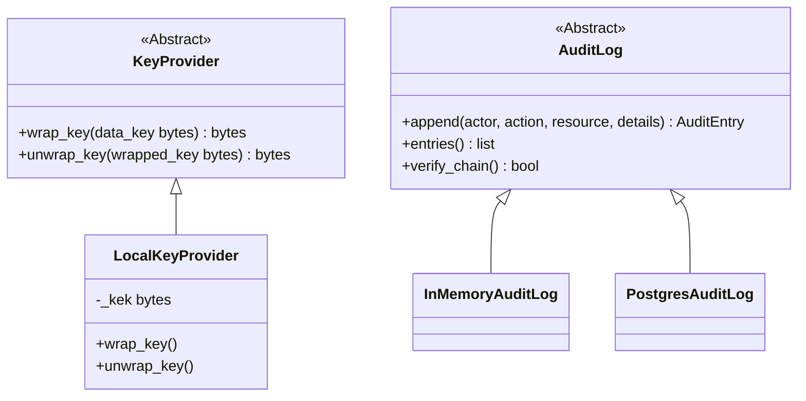

**Testing — 238 Tests Across 29 Files:**
- `test_access_control.py` — Unit: RBAC clearance logic
- `test_encryption.py` — Unit: AES-256-GCM, AAD binding
- `test_injection_corpus.py` — Red-team: 30+ injection phrasings
- `test_orchestrator.py` — Integration: full agent pipeline with fakes
- `test_postgres_stores.py` — Integration: real Postgres

---

## Layer 3 — Databases

> *SQL + relational design, NoSQL tradeoffs, Caching (Redis)*

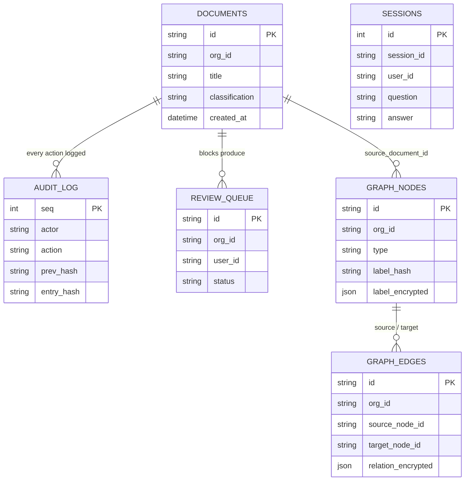

**Indexing strategy:** `org_id` indexed on every table for per-org scans, `label_hash` for O(log n) entity deduplication, `status` on `review_queue` for pending items lookup.

**ACID:** `PostgresAuditLog.append()` executes read-then-insert inside a single `engine.begin()` transaction — hash chain update is atomic.

**Redis (Roadmap):**
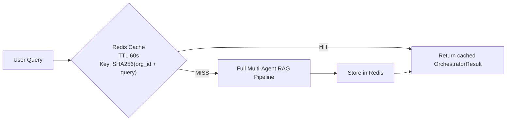

---

## Layer 4 — Backend & APIs

> *REST, FastAPI, OAuth2, JWT, Security*

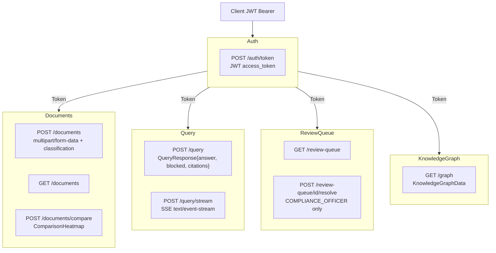

### JWT Auth Flow

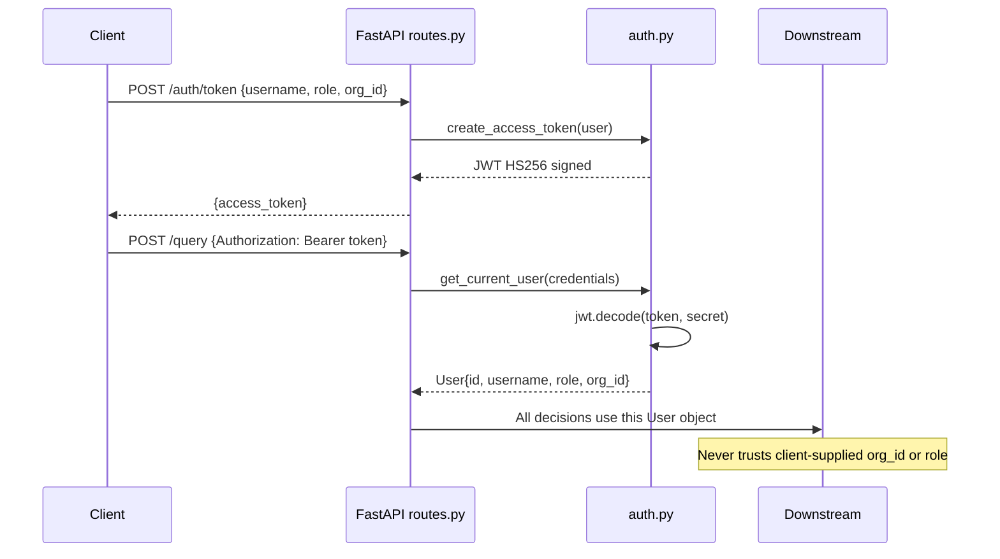

**OWASP Top 10 Coverage:**

| OWASP | Mitigation in FinVault |
|---|---|
| A01 Broken Access Control | `check_clearance()` + `require_same_org()` on every retrieval |
| A02 Cryptographic Failures | AES-256-GCM per-chunk, no plaintext at rest, local embeddings |
| A03 Injection | AST-walker arithmetic, `wrap_untrusted_content`, injection scanner |
| A04 Insecure Design | Fail-closed; Compliance is Python control flow, not a callable tool |
| A07 Auth Failures | JWT verified on every route; malformed tokens = HTTP 401 |
| A09 Logging Failures | Every decision logged to hash-chained audit trail |

---

## Layer 5 — Frontend

> *HTML/CSS/JS, enough to ship*

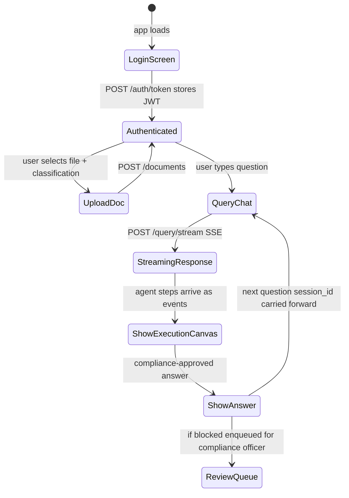

---

## Layer 6 — Distributed Systems & Multi-Agent Architecture

> *CAP theorem, event-driven, microservices vs monolith, message queues*

### Four-Agent Delegation Pattern

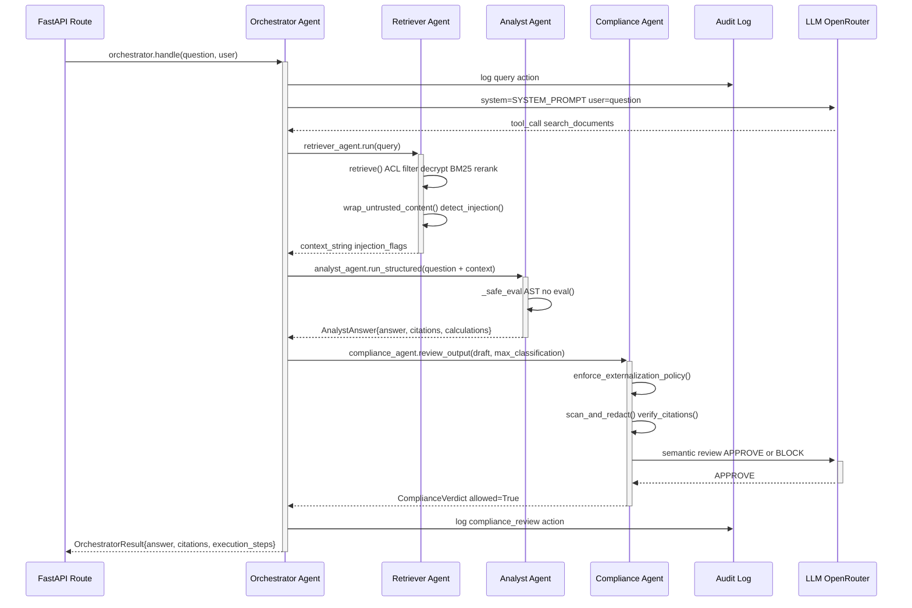

### Fail-Closed Token Budget

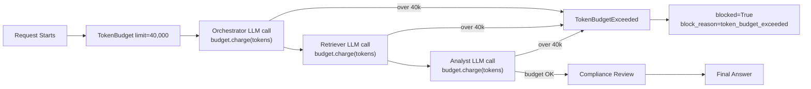

---

## Layer 7 — Cloud & DevOps

> *AWS, Docker, Kubernetes, Terraform, CI/CD, Observability*

### Current Infrastructure

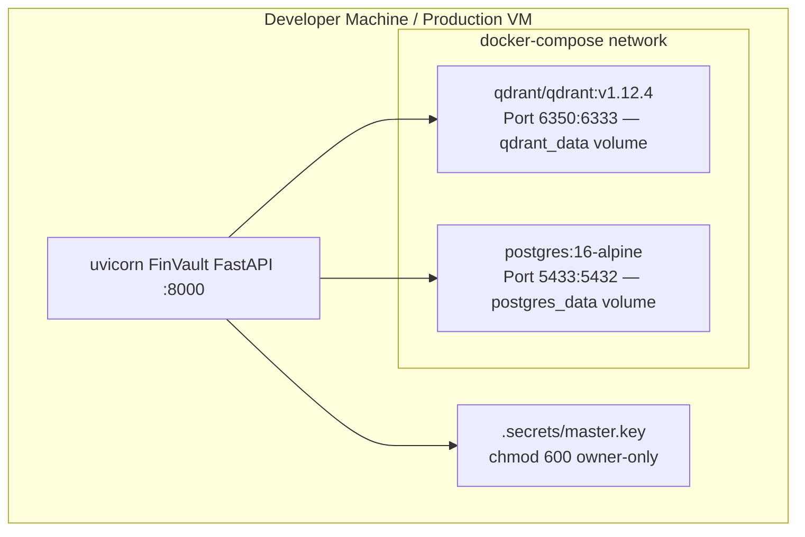

### Production AWS Roadmap

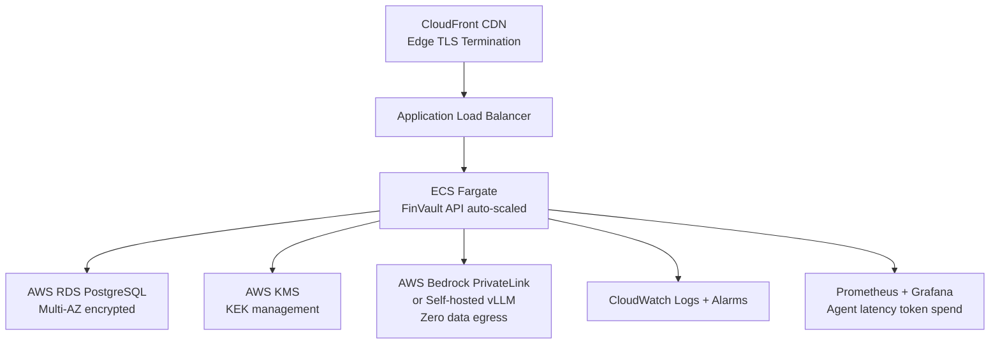

---

## Layer 8 — SaaS-Specific Security Mechanics

> *Multi-tenancy, OWASP Top 10, rate limiting, PCI-DSS awareness*

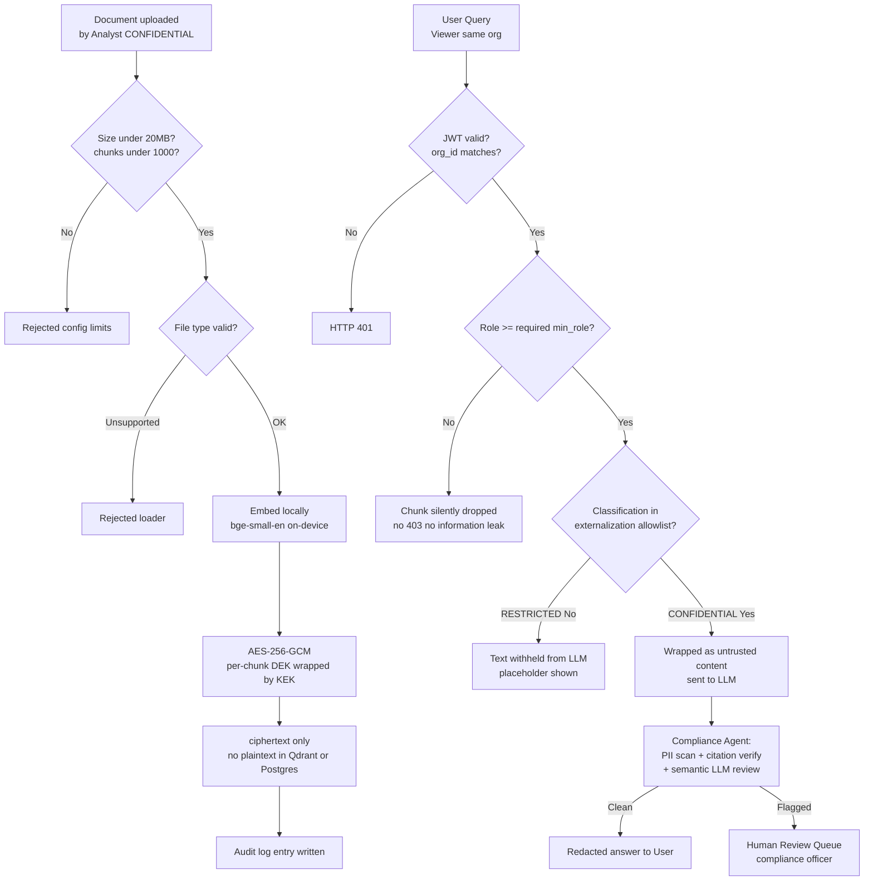

---

## Layer 9 — Data & ML Layer

> *ETL, embeddings, recommendation, ranking, fraud detection, A/B testing*

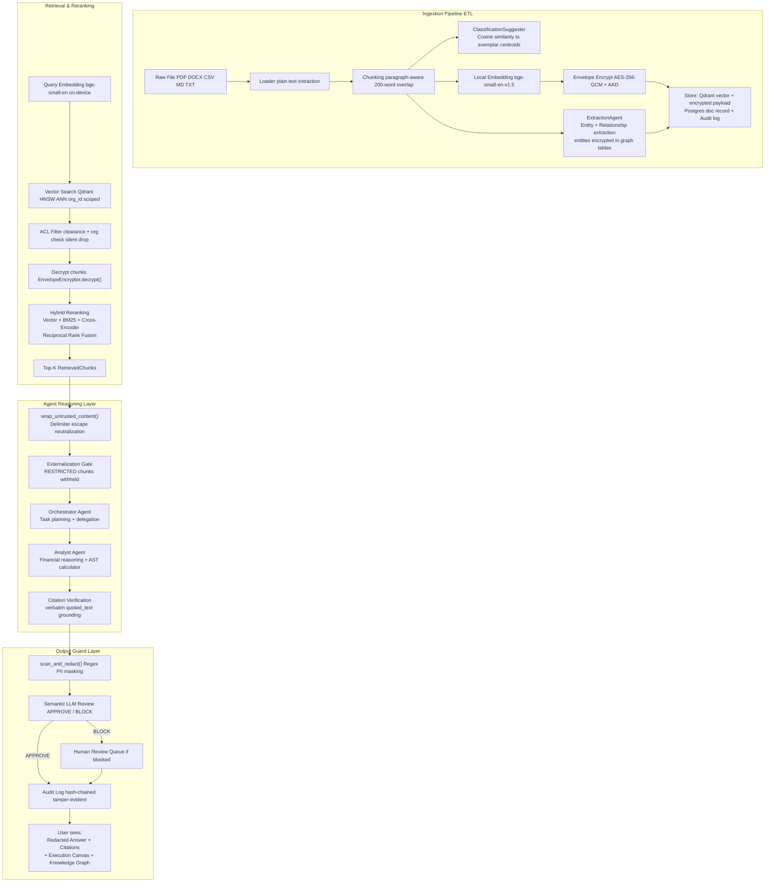

### ML Techniques Used

| Technique | Implementation | File |
|---|---|---|
| Dense Retrieval ANN | HNSW-indexed vector search via Qdrant | `retrieval/vector_store.py` |
| Sparse Retrieval BM25 | `rank_bm25.BM25Okapi` over decrypted candidates | `retrieval/retriever.py` |
| Cross-Encoder Reranking | `cross-encoder/ms-marco-MiniLM-L-6-v2` optional | `retrieval/reranker.py` |
| Reciprocal Rank Fusion | Combines vector, BM25, cross-encoder signals | `retrieval/retriever.py` |
| Zero-Shot Classification | Cosine similarity to exemplar centroids | `ingestion/classification.py` |
| Named Entity Recognition | LLM-based extraction ExtractionAgent | `ingestion/extraction.py` |
| Deterministic Risk Scoring | Coefficient-of-range variance not LLM-scored | `agents/comparison_agent.py` |
| AST-Sandboxed Arithmetic | Python AST walker no eval | `agents/analyst_agent.py` |

---

## Coverage Matrix: Roadmap vs. FinVault

| Layer | Topic | Status | Gap / Next Step |
|---|---|:---:|---|
| 1 | Data Structures & Big-O | ✅ | — |
| 1 | OS: Threads, Async I/O | ✅ | — |
| 1 | Networking: HTTP, SSE | ✅ | Add TLS termination docs |
| 2 | Python OOP, ABCs, Pydantic | ✅ | — |
| 2 | Testing: Unit + Integration | ✅ 238 tests | Add coverage badge + CI |
| 3 | PostgreSQL: ACID, Indexing | ✅ | Add RLS policies |
| 3 | NoSQL: Vector DB | ✅ | — |
| 3 | Caching: Redis | ❌ | Add query + embedding cache |
| 4 | REST API FastAPI | ✅ | — |
| 4 | JWT Auth + RBAC | ✅ | Connect to real IdP Okta |
| 4 | OWASP Security | ✅ | Add rate limiting middleware |
| 5 | Frontend SPA | ✅ | Upgrade to React for scale |
| 6 | Multi-Agent Orchestration | ✅ 5 agents | — |
| 6 | Event-driven message bus | ✅ ExecutionEventBus | Externalize to Kafka |
| 6 | Token budgeting backpressure | ✅ | — |
| 7 | Docker | ✅ | — |
| 7 | Kubernetes | ❌ | Add K8s manifests / Helm chart |
| 7 | CI/CD | ❌ | GitHub Actions: pytest + lint |
| 7 | Observability | 🔶 Audit log only | Add Prometheus + Grafana |
| 8 | Multi-tenancy isolation | ✅ 5-layer | Add PostgreSQL RLS |
| 8 | Billing / Rate Limiting | ❌ | Stripe + rate-limit middleware |
| 8 | PCI-DSS awareness | ✅ IBAN/CC redaction | — |
| 9 | Local Embeddings ETL | ✅ | — |
| 9 | Hybrid Reranking | ✅ BM25 + Cross-Encoder + RRF | — |
| 9 | Zero-shot Classification | ✅ | Train a real classifier |
| 9 | Knowledge Graph | ✅ | Add graph traversal queries |
| 9 | Deterministic Risk Scoring | ✅ | Extend to time-series trends |
| 9 | A/B Testing Infrastructure | ❌ | Add experiment framework |

---

## Recommended Reading, Mapped to FinVault

| Book / Course | Layer | Seen In FinVault |
|---|---|---|
| MIT 6.006 Introduction to Algorithms | 1 | BM25 term-doc matrix, RRF sort, HNSW graph |
| MIT 6.033 Computer Systems | 1 | uvicorn async event loop, threading in SSE |
| CMU 15-445 Database Systems | 3 | Indexing in `db.py`, ACID in `audit.py` |
| FastAPI Advanced Docs | 4 | SSE streaming, Depends() injection |
| Designing Data-Intensive Applications Kleppmann | 6 | Multi-agent consistency, hash-chained audit log |
| MIT 6.824 Distributed Systems | 6 | Agent failure modes, fail-closed posture |
| AWS Solutions Architect | 7 | Docker isolation, production AWS roadmap |
| OWASP Top 10 | 8 | ACL, injection defense, auth, logging |
| The Little Book of Deep Learning | 9 | Embedding models, BM25, cross-encoder |

---

*Generated: 2026-08-31 | FinVault Phase 1 — 73 Python files, 238 tests, 236 passing*
